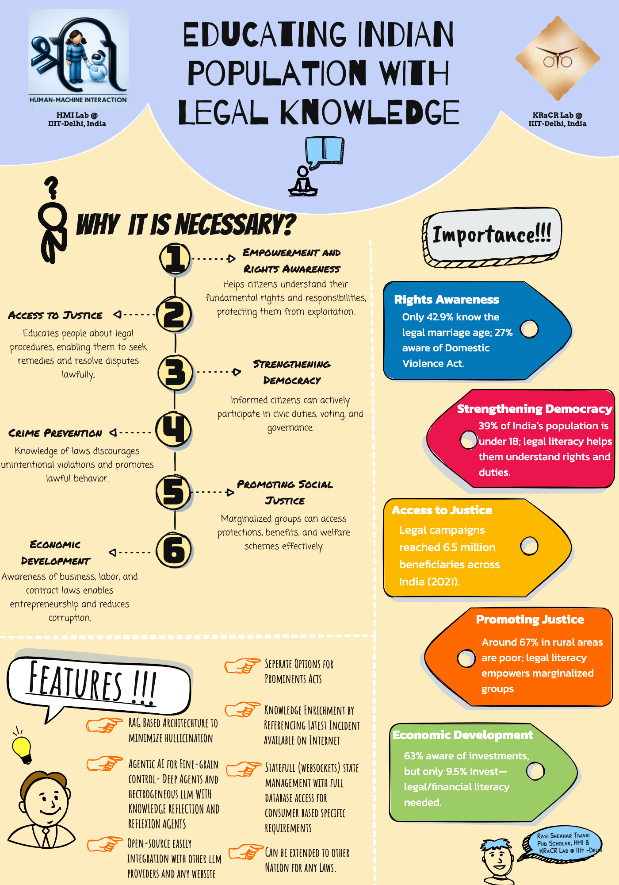
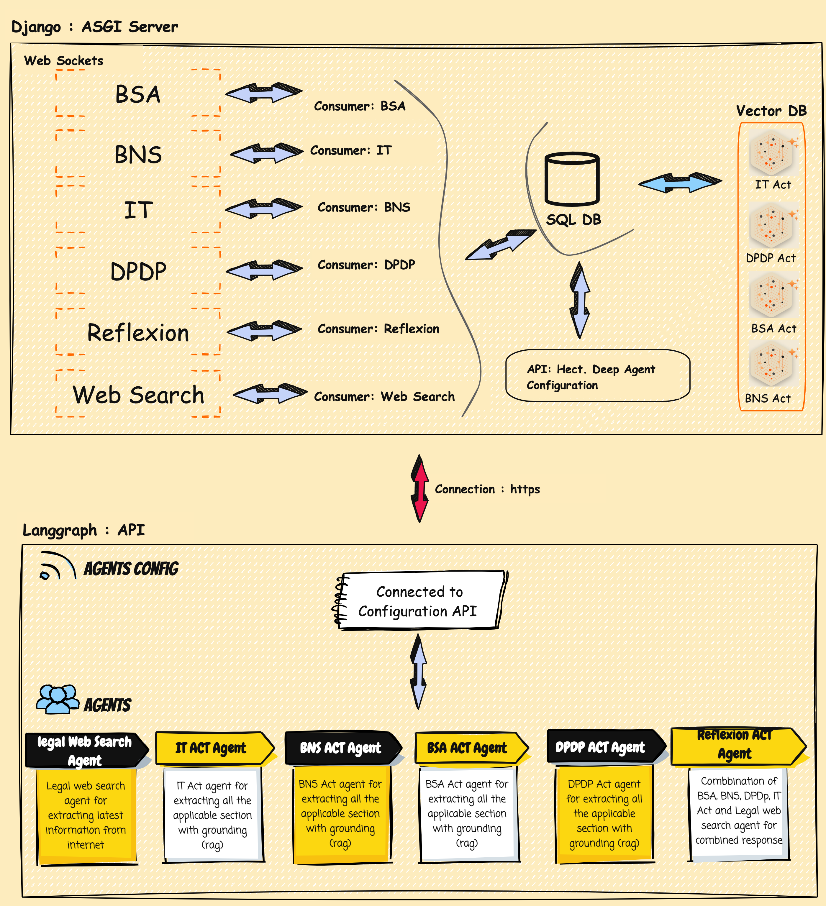

  <h1>Educating Indian Population with Legal Knowledge</h1>

# 🇮🇳 Agentic AI Legal Assistant for India’s Digital Era

Educating the Indian population on legal knowledge — especially under the **Bharatiya Nyaya Sanhita (BNS)**, **Bharatiya Suraksha Adhiniyam (BSA)**, **Information Technology (IT) Act**, and the **Digital Personal Data Protection (DPDP) Act** — is crucial in today’s digital era.  

With India rapidly moving towards **digital governance** and **AI-driven services**, citizens must understand their **rights**, **responsibilities**, and **legal protections** to ensure **accountability**, **privacy**, and **fair use of technology**.  

Most individuals remain unaware of the implications of data misuse, cybercrimes, or procedural rights under new legal frameworks.  

To address this gap, I have developed an **Agentic AI Legal Assistant**, powered by multiple specialized agents trained using **Retrieval-Augmented Generation (RAG)** with **Gemini API**, **LangChain**, **LangSmith**, and **Django WebSockets**.  

Each agent focuses on one domain — **IT**, **DPDP**, **BSA**, **BNS**, and **Legal Web Search** — while a **Reflexion Agent** synthesizes and contextualizes the combined insights to deliver **accurate, legally-grounded responses**.  

This system empowers **citizens**, **legal practitioners**, and **policymakers** to interact intelligently with India’s evolving legal ecosystem, fostering **digital literacy** and **legal empowerment at scale**.

> **AI-powered legal assistant using RAG and multi-agent systems on BNS, BSA, IT, and DPDP Acts to empower Indians with accurate, accessible, and actionable legal awareness for the digital era.**

---

## 💡 Inspiration

India is undergoing a major legal transformation with the introduction of the **Bharatiya Nyaya Sanhita (BNS)**, **Bharatiya Suraksha Adhiniyam (BSA)**, **Information Technology (IT) Act**, and the **Digital Personal Data Protection (DPDP) Act**.  

Despite this, most citizens are unaware of their rights and responsibilities under these laws. This lack of awareness leads to **misinformation**, **data misuse**, and **vulnerability to cybercrimes**.  

Inspired by this challenge, I set out to create an **AI-powered legal assistant** that helps every Indian easily understand and access **accurate legal information**.

---

## ⚙️ What It Does

The project is an **Agentic AI Legal Application** that uses multiple specialized agents — each focused on **IT**, **DPDP**, **BNS**, **BSA**, and **Legal Web Search**.  

These agents retrieve and process relevant legal information using **Retrieval-Augmented Generation (RAG)**.  

A central **Reflexion Agent** integrates and refines the responses to provide **clear**, **accurate**, and **context-aware legal insights** to users.

---

## 🏗️ How We Built It

The system was developed using:  
- **Gemini API**  
- **LangChain**  
- **LangSmith**  
- **Django WebSockets**

Each agent was designed with **domain-specific knowledge bases** and connected through **RAG pipelines** for retrieval and reasoning.  

The **Reflexion Agent** employs an **ensemble approach** to merge outputs, ensuring **comprehensive legal guidance**.

The platform will also incorporate interactive visual graphics, enabling users to engage visually with legal concepts for clearer understanding and improved learning.

  <h2>Overview of Chrome Extension</h2>
  

    
  

  <h2>Chrome Extension Structure</h2>
  

    
  

---

## 🚧 Challenges We Ran Into

- Synchronizing multiple agent responses in real time  
- Ensuring factual consistency across different legal domains  
- Reducing latency during high-volume queries  
- Maintaining compliance with India’s legal terminology and context  

---

## 🏆 Accomplishments We’re Proud Of

- Successfully built a **multi-agent RAG-based AI legal system**  
- Integrated **five distinct legal domains** under a unified framework  
- Achieved **real-time legal search and reasoning** using WebSockets  
- Created a platform that bridges the **gap between citizens and legal awareness**  

---

## 📚 What We Learned & Next Steps

The next step is to enhance the platform by integrating:  
- **Regional language support**  
- **Voice-based legal queries**  
- **Explainable AI (XAI)** features  

These improvements will make interactions more **natural**, **transparent**, and **inclusive**.  

Additionally, collaboration with **legal experts** and **government bodies** will ensure **compliance**, **accuracy**, and **large-scale public adoption**.  

The platform will also incorporate **interactive visual graphics**, enabling users to **engage visually** with legal concepts for **clearer understanding** and **improved learning**.

  <h2 style="text-align:center;">🚀 Cloning the Repository</h2>
  <ol style="text-align:left;">
    <li>
      <strong>📦 Installing Required Packages</strong> 
      <code>fdfdfdfdfdfdf</code>
    </li>
    <li>
      <strong>⚙️ Application Set-up</strong>
      <ul>
        <li>
          <strong>🔑 API-keys</strong> 
          <code>fdfdfdfdfdfdf</code>
        </li>
        <li>
          <strong>🗄️ Database Setup</strong> 
          <code>fdfdfdfdfdfdf</code>
        </li>
        <li>
          <strong>🌐 Starting Django WSGI Server</strong> 
          <code>fdfdfdfdfdfdf</code>
        </li>
        <li>
          <strong>🧠 Starting LangGraph Server</strong> 
          <code>fdfdfdfdfdfdf</code>
        </li>
        <li>
          <strong>🧩 Chrome Extension Set-up</strong> 
          <code>fdfdfdfdfdfdf</code>
        </li>
      </ul>
    </li>
  </ol>

<h2>>👨‍💻 Developed By:</h2> 
 
  
 
    
 <strong>🧠 Ravi Shekhar Tiwari</strong>  
    <i>🎓  Phd Scholar in Neuro-Symbolic AI</i>  
    <i><strong>🏛️ HMI and KRaCKR Lab @ IIIT Delhi</strong></i> 
  
  
  
 
 
 
  
 <strong>Vinay Kumar Verma</strong>  
    <i>🎓  Phd Scholar in Robotics</i> 
    <i><strong>🏛️HMI Lab @ IIIT Delhi</strong></i> 
  
 
  
 
  
 
  

  <h2 style="text-align:center;">Acknowledgement</h2>
  

    We would like to express our heartfelt gratitude to  
    <strong>Saumya Yadav</strong> <i><strong>HMI and KRaCKR Lab @ IIIT Delhi</strong></i> for her continuous invaluable technical assistance and collaboration that greatly enhanced the quality of our research. 
  

  

  <figure style="margin:0; text-align:center; width:45%;">
    
    <figcaption><b>Human Machine Interaction (HMI) Lab @ IIIT-Delhi</b></figcaption>
  </figure>
  <figure style="margin:0; text-align:center; width:45%;">
    
    <figcaption><b>Knowledgeable Computing and Reasoning (KRaCKR) Lab @ IIIT-Delhi</b>
  </figure>

